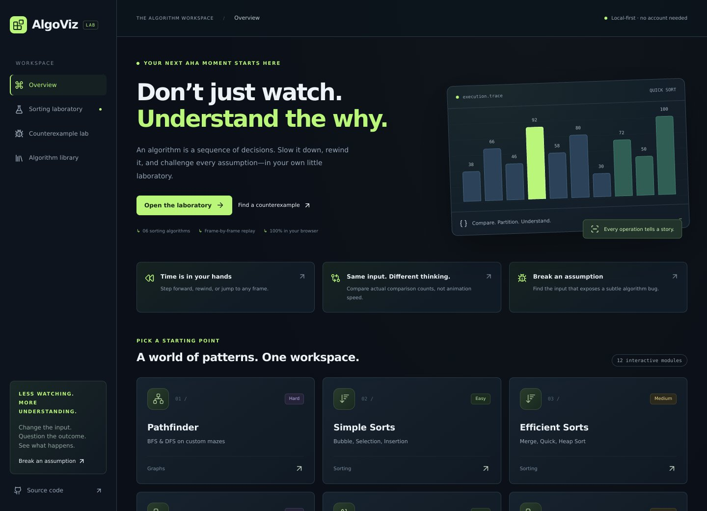
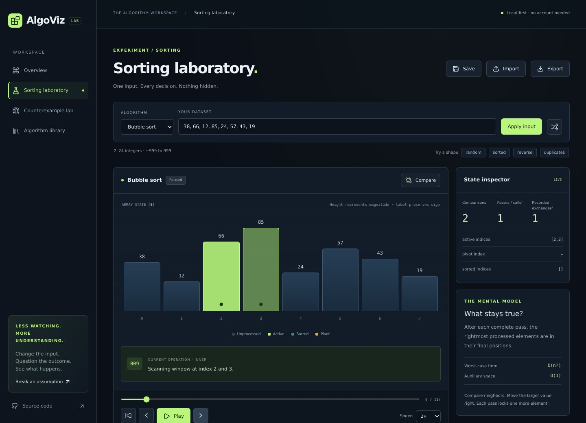

<div align="center">

# AlgoViz 2.0

### Don’t just watch. Understand the why.

Trace the decisions. Compare the strategies. Find the input that breaks the assumption.

<br />

[](https://algoviz-2-0.vercel.app/)
[](https://github.com/Siva2583/Algoviz-2.0)

<br />


**Browser-based execution · Recorded-state replay · Local experiments**

</div>

<br />

[](https://algoviz-2-0.vercel.app/)

<div align="center">
<sub>One workspace for exploring algorithms—not just watching them finish.</sub>
</div>

<br />

<table>
<tr>
<td width="33%" valign="top">

### ⏮ Inspect every step

Pause, rewind, and seek through a sorting execution. See the array, active indices, pivot, and operation explanation.

[Open Sorting Lab →](https://algoviz-2-0.vercel.app/lab)

</td>
<td width="33%" valign="top">

### ⇄ Compare strategies

Give two sorting algorithms the same input. Compare recorded comparison counts rather than animation timings.

[Try Comparison Mode →](https://algoviz-2-0.vercel.app/lab?compare=1)

</td>
<td width="33%" valign="top">

### ⌕ Challenge assumptions

Predict the answer, expose a subtle bug, and inspect the decision where two implementations disagree.

[Find a Counterexample →](https://algoviz-2-0.vercel.app/counterexample)

</td>
</tr>
</table>

---

## The idea

An animation can show **what happened** without helping you understand **why it happened**.

AlgoViz makes the intermediate decisions inspectable: which elements are compared, how search bounds change, why a branch is rejected, and where a mistaken condition produces the wrong answer.

Version 2.0 evolves the original visualization project into a more interactive learning workspace:

```text
     CREATE             OBSERVE             QUESTION              REPEAT
  Choose an input  →  Inspect execution  →  Test an assumption  →  Try again
```

**Current scope:** a client-side React application. Built-in algorithms run in the browser. There is no application backend, authentication, cloud database, AI service, or arbitrary user-code execution.

---

## 01 / The sorting laboratory

### Your input. Every decision. At your pace.

[](https://algoviz-2-0.vercel.app/lab)

**Bubble · Selection · Insertion · Merge · Quick · Heap**

| Capability | What it lets you do |
|---|---|
| **Playback controls** | Play, pause, restart, replay, and step forward/back |
| **Execution timeline** | Jump directly to a recorded frame |
| **State inspector** | Inspect active/sorted indices, pivot information, and counters |
| **Operation explanations** | Read the message associated with the current frame |
| **Final-state retention** | Study the completed result without it disappearing |
| **Dataset presets** | Explore seeded random, sorted, reverse, and duplicate-heavy inputs |
| **Comparison mode** | Compare complete-run comparison counts on identical inputs |
| **Learning notes** | Read algorithm intuition, invariants, complexity, and pseudocode |

Sorting inputs support **2–24 integers between −999 and 999**. This intentionally keeps full-frame traces manageable and individual operations readable.

**Keyboard shortcuts:** `Space` to play/pause, `←` and `→` to step when focus is outside form controls.

> **An important distinction:** rewinding selects an earlier recorded state. It does not execute JavaScript backward.

### Compare honestly

Animation speed is a learning control—not an execution-time measurement.

The comparison panel uses recorded comparison counts. Its previews align by percentage of trace completion, not equivalent semantic operations. Pass/call and exchange counters remain implementation-specific and should not be treated as interchangeable cross-algorithm measurements.

---

## 02 / The counterexample lab

### A working example is not proof.

Consider this problem:

> Find the shortest contiguous subarray whose sum is **at least** the target.

Both implementations expand and shrink a window. One records every qualifying window; the other records only exact matches.

<table>
<tr>
<th>Input</th>
<th>Reference result</th>
<th>Buggy result</th>
</tr>
<tr>
<td align="center"><code>[2, 3]</code><br />Target: <code>4</code></td>
<td align="center"><strong>2</strong></td>
<td align="center"><strong>0</strong></td>
</tr>
</table>

```js
// Reference: the window qualifies.
if (sum >= target) {
  best = Math.min(best, right - left + 1);
}

// Buggy variant: larger qualifying sums are skipped.
if (sum === target) {
  best = Math.min(best, right - left + 1);
}
```

The sum is **5**. It qualifies because **5 ≥ 4**, but the buggy variant ignores it because **5 ≠ 4**.

The lab lets you:

1. **Predict** the correct result.
2. **Compare** the outputs.
3. **Inspect** the first recorded divergence.
4. **Search** for a smaller failing input within a bounded domain.

The search uses positive arrays of length **1–3**, values **1–4**, and targets **1–8**. It returns the first failure in the defined enumeration order—not a universal minimality proof or a general-purpose bug finder.

[**Explore the counterexample →**](https://algoviz-2-0.vercel.app/counterexample)

---

## 03 / Keep the interesting experiments

Found an input worth revisiting?

- **Save locally:** retain the latest six sorting experiments in the current browser.
- **Resume inspection:** restore the algorithm, input, and frame position.
- **Export JSON:** keep a portable experiment file.
- **Import JSON:** validate and reload experiment files up to 16 KB.

No account is needed.

Saved data uses `localStorage`, so it belongs to the current browser and origin. It may be cleared and does not automatically sync between devices. Export provides the portable backup.

---

## 04 / A library, not a collection of disconnected screens

The overview, dedicated labs, and individual modules share navigation, typography, panels, and controls.

Individual module pages include an experiment switcher and **Visualize / Learn the concept** views. Learning notes include numbered steps, dry runs, pseudocode, complexity information, and common mistakes.

On smaller screens, navigation remains visible, the N-Queens board appears before its console, and the pathfinding grid scrolls instead of compressing its cells.

<details>
<summary><strong>Explore all 12 module entries</strong></summary>

<br />

| Module | Implemented behavior |
|---|---|
| **Simple Sorts** | Bubble, Selection, and Insertion Sort |
| **Efficient Sorts** | Merge, Quick, and Heap Sort |
| **Binary Search** | Iterative search with left/middle/right bounds |
| **Pathfinder** | BFS and DFS on a grid with editable walls |
| **Tree Traversals** | Preorder, inorder, and postorder |
| **N-Queens** | Backtracking visualization and an interactive placement board |
| **Two Pointers** | String/palindrome-style converging-pointer checks |
| **Fast & Slow Pointers** | Move Zeroes using read/write-style pointers |
| **Binary Search Variants** | First and last occurrence |
| **Prefix Sum** | Prefix construction and inclusive range-sum queries |
| **Sliding Window** | Shortest qualifying positive-number window with sum ≥ target |
| **Merge Intervals** | Sorting and merging overlapping intervals |

Some entries contain multiple algorithms; “12 modules” does not mean twelve distinct algorithms.

**Implementation details that matter:**
- Tree input represents an array-indexed binary tree, not automatic BST insertion.
- Fast & Slow Pointers demonstrates Move Zeroes, not Floyd’s cycle detection.
- BFS finds a shortest path on this unweighted grid; DFS finds a path that is not necessarily shortest.
- Sorting routes use the shared laboratory. Other modules retain their algorithm-specific execution implementations.

</details>

<br />

[**Browse the algorithm library →**](https://algoviz-2-0.vercel.app/library)

---

## Under the hood

### Separate execution from playback

```text
                    INPUT + ALGORITHM
                            │
                            ▼
                  Validate bounded input
                            │
                            ▼
                Generate execution frames
                            │
                            ▼
                   PLAYBACK REDUCER
                cursor · length · playing
                            │
             ┌──────────────┼──────────────┐
             ▼              ▼              ▼
        Array view     State inspector   Explanation
                            │
                            ▼
                    Timeline controls

       Algorithm + input + cursor → local save / JSON export
```

The sorting generators produce frames before playback begins. React renders the selected frame.

Stable element IDs travel with their elements during sorting, distinguishing equal values and making traces reproducible for the same input and implementation.

A reducer handles playback transitions. A React effect schedules advances and cleans up its timer when replaced or unmounted.

**The shared UI covers all modules; the shared sorting playback reducer does not yet cover every algorithm family.**

<details>
<summary><strong>Engineering decisions and trade-offs</strong></summary>

<br />

| Decision | Why |
|---|---|
| **Keep React + Vite** | The interaction is browser-driven; a framework migration is unnecessary |
| **Reuse existing generators** | Improve execution inspection without discarding working algorithm code |
| **Use a playback reducer** | Make transport transitions explicit and testable |
| **Record full frames** | Straightforward inspection and rewind, at a higher memory cost |
| **Bound sorting input size** | Control trace growth instead of claiming untested scalability |
| **Generate seeded datasets** | Reproduce inputs when comparing strategies |
| **Lazy-load routes** | Avoid downloading every visualization module at startup |
| **Use local persistence** | Save useful experiments without premature backend infrastructure |
| **Use Node’s test runner** | Add executable correctness checks without another framework dependency |

Full snapshots are a deliberate first implementation. A quadratic algorithm that copies an entire array into each frame can produce cubic trace storage. Compact events, checkpoints, and workers are future improvements—not current capabilities.

</details>

---

## Stack

| Layer | Technology |
|---|---|
| Interface | React 19 · JavaScript / JSX |
| Routing | React Router DOM 7 |
| Styling | Tailwind CSS 3 · scoped custom CSS |
| Icons | Lucide React |
| Build | Vite using the `rolldown-vite` package alias |
| State | React hooks · local component state · sorting playback reducer |
| Persistence | `localStorage` · JSON import/export |
| Tests | Node.js `node:test` · `node:assert/strict` |
| Checks & delivery | ESLint · GitHub Actions · Vercel |

**No Next.js, Redux, external animation framework, backend, or AI API is required.**

---

## Run it locally

Requires **Node.js 22.12+** and npm. Node 22 matches the checked-in `.nvmrc` and CI configuration.

```bash
git clone https://github.com/Siva2583/Algoviz-2.0.git
cd Algoviz-2.0
npm ci
npm run dev
```

Open the address printed by Vite, usually **http://localhost:5173**.

No environment variables or API keys are needed.

| Command | Purpose |
|---|---|
| `npm run dev` | Start the development server |
| `npm run build` | Build the production app in `dist/` |
| `npm run preview` | Preview the production build |
| `npm test` | Run correctness, playback, validation, and regression tests |
| `npm run lint` | Run repository-wide ESLint checks |
| `npm run lint:lab` | Check the new workspace and route configuration |

<details>
<summary><strong>Windows and setup troubleshooting</strong></summary>

<br />

If PowerShell blocks npm scripts:

```powershell
npm.cmd ci
npm.cmd run dev
```

If `npm` is not recognized, install Node.js and restart your terminal.

If npm cannot find `package.json`, open the terminal in the extracted project’s inner folder—not its parent directory.

Do not open `index.html` directly or use VS Code Live Server. Vite processes the application’s modules and JSX.

The development server binds to all interfaces for hosted previews. Use it only in a trusted development environment; production hosting should serve the built application.

</details>

---

## Tested behavior

The current automated suite contains **14 test groups**, including generated cases.

| Area | Coverage |
|---|---|
| Sorting | Expected output, input preservation, deterministic frames, and final ID uniqueness |
| Generated inputs | Edge cases and 20 seeded datasets per sorting algorithm |
| Playback | Cursor bounds, completion retention, replay, and pausing on seek |
| Validation | Invalid sorting inputs and reproducible datasets |
| Counterexamples | Sliding-window regression and reproducible failure search |
| Reference checking | Window implementation versus a brute-force oracle for 64 arrays × 12 targets |
| Other algorithms | Pathfinder preservation/reachability checks and prefix-range validation |

```bash
npm test
npm run lint
npm run build
```

GitHub Actions runs the checks after a clean dependency installation.

Additional browser smoke checks have covered the main interactions and responsive module views. These are **not** exhaustive correctness proofs, a repository-contained automated browser suite, or a WCAG certification.

[Verification notes →](docs/VERIFICATION.md)

---

## What this project does not claim

A useful tool should be clear about its boundaries.

- **Not a general code debugger:** execution is limited to built-in implementations.
- **Not an AI tutor:** explanations come from built-in messages and learning content.
- **Not a benchmark platform:** comparison counts are not runtime or heap-memory measurements.
- **Not cloud storage:** saved experiments remain local unless exported.
- **Not an unbounded engine:** sorting uses synchronous, full-frame generation with a 24-element cap.
- **Not a completed architecture migration:** non-sorting playback, validation, and accessibility still have room for improvement.

Exports do not archive an entire engine version. Changes to frame order in future releases can affect the meaning of an old cursor.

Tutorial material remains open to correction; it is educational guidance rather than a formally reviewed curriculum.

Weighted Dijkstra, Floyd cycle detection, rotated-array search, and tree level-order traversal are **not current features**.

<details>
<summary><strong>A note about linting and legacy code</strong></summary>

<br />

`react-hooks/set-state-in-effect` is explicitly disabled for legacy `src/modules/**/*.jsx`, where input-to-preview synchronization still uses effects. New lab code retains the stricter rule.

The original generators also remain under `src/modules/core/algorithm/sorting/algorithms/`, including some non-sorting logic. That naming is legacy organization and a candidate for incremental cleanup.

</details>

---

## Deploy

**Live:** https://algoviz-2-0.vercel.app/

| Vercel setting | Value |
|---|---|
| Framework preset | Vite |
| Install command | `npm ci` |
| Build command | `npm run build` |
| Output directory | `dist` |
| Node.js | 22.x |

The included `vercel.json` supplies the SPA fallback so routes such as `/lab` work when opened directly.

---

## What’s next

- [ ] Migrate another algorithm family to shared playback.
- [ ] Introduce compact trace events and checkpoints.
- [ ] Add worker execution before increasing input limits.
- [ ] Expand curated counterexamples with independently checked references.
- [ ] Extend keyboard, screen-reader, and touch testing.
- [ ] Add an automated browser regression suite.

**Engineering depth before feature count.** These are planned improvements, not existing features.

---

## Contribute

A reproducible bug, a clearer explanation, or a focused test is a valuable contribution.

Include the module, exact input, expected behavior, actual behavior, and reproduction steps. Before submitting a change, run:

```bash
npm test && npm run lint && npm run build
```

Please keep algorithm-semantic changes and visual redesigns separate where practical.

---

<div align="center">

### Built by Siva Charan K.G.

[GitHub](https://github.com/Siva2583) ·
[LinkedIn](https://www.linkedin.com/in/siva-charan-kg-72a900284/) ·
[Explore AlgoViz](https://algoviz-2-0.vercel.app/)

<br />

**Change the input. Question the outcome. Understand the algorithm.**

</div>
